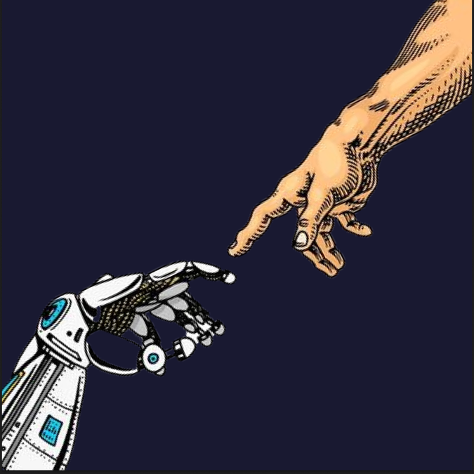
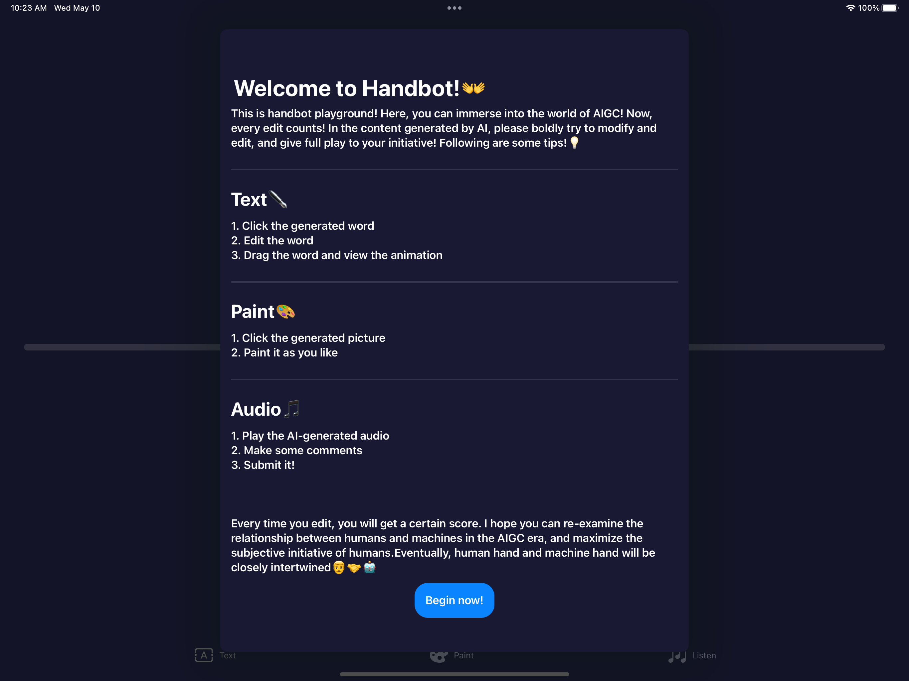
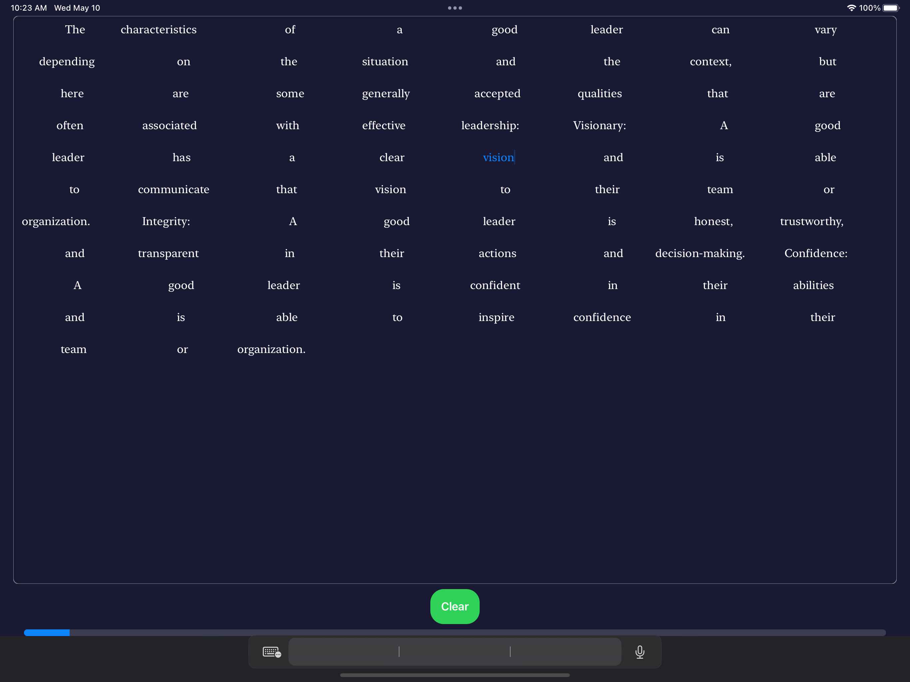
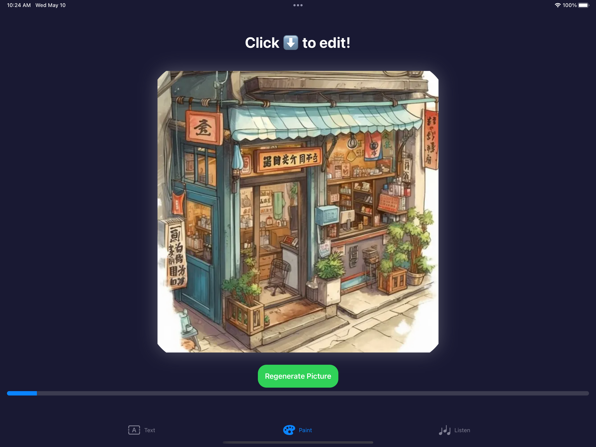
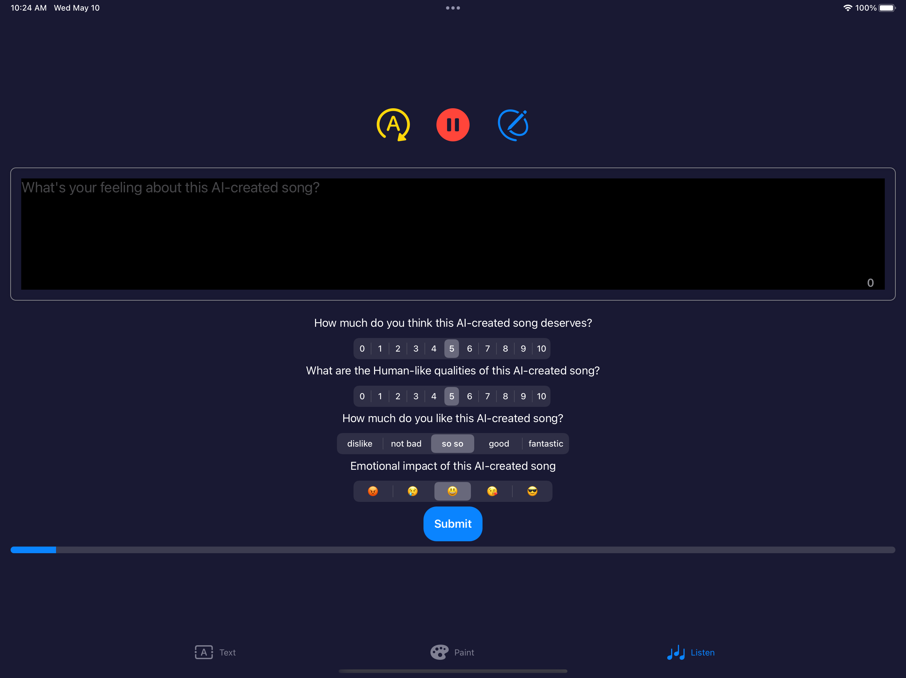

# Handbot

This repository is for my Handbot playground created for Swift Student Chanllenge in WWDC2023

Demo video: [Youtube](https://youtu.be/AQyzqk6_YjY)

### Why do I want to create this playground?

In this AIGC era, my work hopes to encourage people to think about AI-generated content, encourage people to edit and modify AI-generated content, so as to achieve true human-machine collaboration Following is the github repository: Welcome to contact me and communicate with me!😊

### Features

There are three main parts in my playground.

#### Text

- Highlight the word by clicking it.
- Edit the word.
- Drag the word around and view the animation.
- 

#### Painting

- Repaint the AI-generated picture.

#### Audio

- Make some comments about the AI-created songs.

### Requirements

Supported Devices:

- iPad Pro 11-inch or 12.9-inch
- Mac

Supported Platforms:

- iPadOS 16 or later
- macOS 13 Ventura or later

### Installation

- Clone the repository.

- Open the `Handbot.swiftpm` file with Swift Playgrounds or Xcode.
- Run the project.

### Usage

- Follow the instructions in the playground.

### Credits

#### Text

OpenAI ChatGPT 

#### Painting

Midjourney

#### Audio

All the audios are demos in this [paper](https://google-research.github.io/seanet/musiclm/examples/).

- Title **MusicLM: Generating Music From Text**

- Author **Andrea Agostinelli and Timo I. Denk and Zalán Borsos and Jesse Engel and Mauro Verzetti and Antoine Caillon and Qingqing Huang and Aren Jansen and Adam Roberts and Marco Tagliasacchi and Matt Sharifi and Neil Zeghidour and Christian Frank**

### Future Plan

- Integrate the API of AIGC products such as OpenAI and Midjourney to enable networking.
- Implement more visual and draggable interactions for controlling the AI-generated music section.

- Implement real-time saving functionality.
